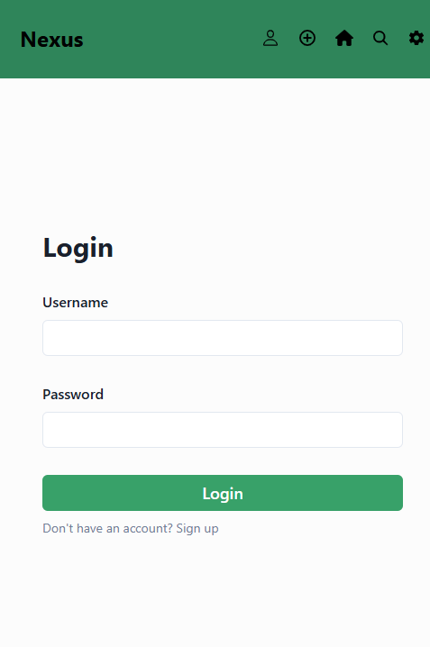
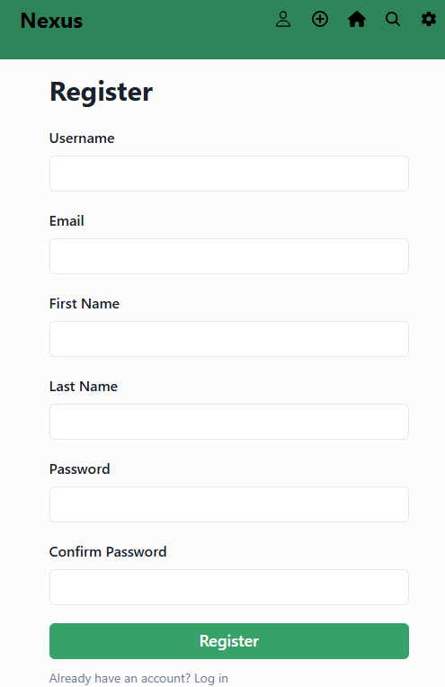
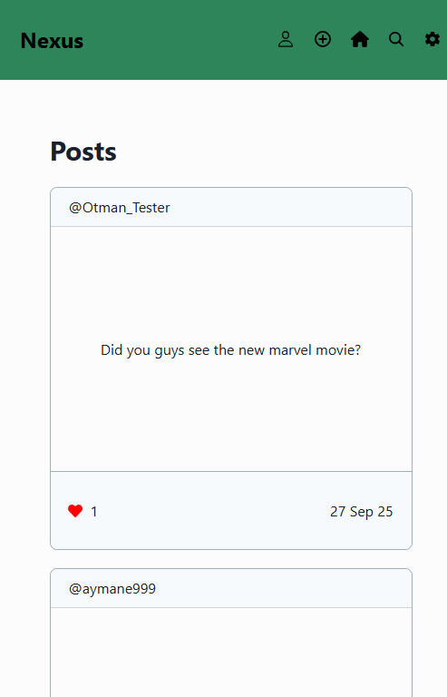
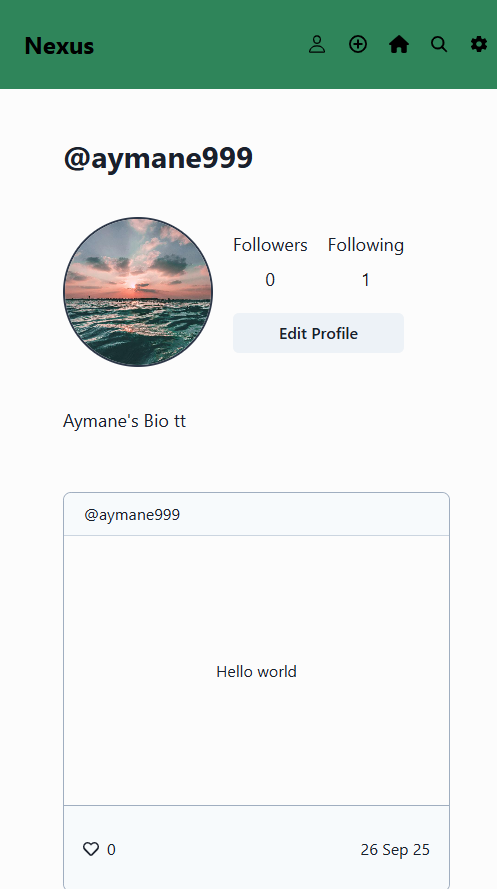
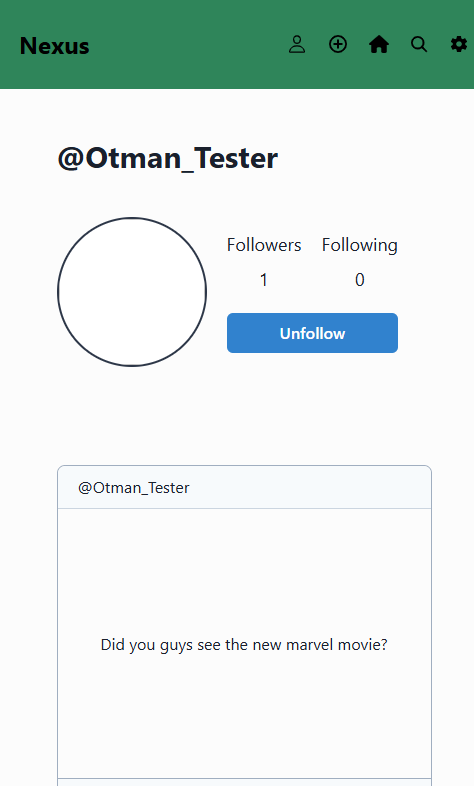
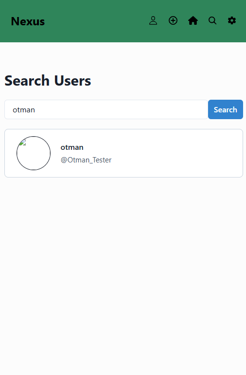
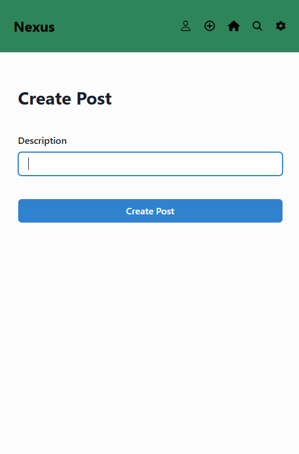
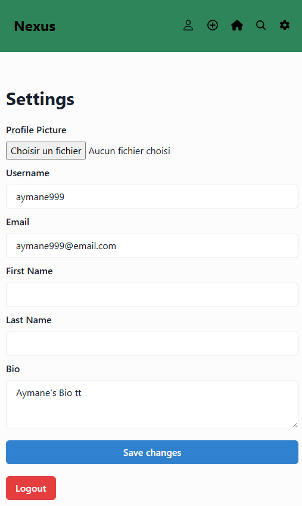

🌐 Nexus — Social Media Feed

Project Nexus 
A full-stack social feed application (React frontend + Django REST backend). Built as a professional portfolio piece to demonstrate advanced frontend skills, API integration, authentication, and a production-ready structure.

📌 Quick facts

Frontend: React (react-scripts) — frontend/

Backend: Django + Django REST Framework — backend/

API base used by frontend: http://127.0.0.1:8000/api (see frontend/src/constants/constants.js)

DB: SQLite (included as backend/db.sqlite3)

This archive contains: social_media_website - Copy/ (root folder), with frontend/ and backend/ inside.

✅ Features

Authentication: login & register (JWT tokens).

Home feed: aggregated posts.

Post creation (create_post endpoint).

User profile pages (user_data).

Search users.

Follow / unfollow (toggle_follow).

Like / unlike posts (toggleLike).

Settings page (update profile).

Media uploads (user avatars / post media) — served from MEDIA_URL/MEDIA_ROOT.

Responsive UI components (React + Chakra UI present in package.json).

📁 Exact project structure (cleaned, relevant files only)
social_media_website - Copy/
├─ backend/
│  ├─ .dockerignore
│  ├─ db.sqlite3
│  ├─ Dockerfile
│  ├─ fly.toml
│  ├─ manage.py
│  ├─ backend/               # Django project
│  │  ├─ asgi.py
│  │  ├─ settings.py
│  │  ├─ urls.py
│  │  └─ wsgi.py
│  └─ base/                  # Django app
│     ├─ admin.py
│     ├─ authenticate.py
│     ├─ models.py
│     ├─ serializers.py
│     ├─ urls.py
│     ├─ views.py
│     └─ migrations/...
└─ frontend/
   ├─ package.json
   ├─ public/
   │  └─ index.html
   └─ src/
      ├─ App.js
      ├─ index.js
      ├─ api/
      │  └─ endpoints.js
      ├─ components/
      │  ├─ layout.js
      │  ├─ navbar.js
      │  └─ post.js
      ├─ constants/
      │  └─ constants.js   (SERVER_URL = 'http://127.0.0.1:8000/api')
      ├─ contexts/
      │  └─ useAuth.js
      └─ routes/
         ├─ home.js
         ├─ login.js
         ├─ register.js
         ├─ create_post.js
         ├─ user_profile.js
         ├─ search.js
         └─ settings.js

Note: node_modules/ and venv/ were included in the zip you uploaded; they are large and should be removed from the repo (add to .gitignore) before publishing on GitHub.

🛠️ Tech stack (from your files)

Frontend

React (react, react-dom)

react-router-dom

axios (API calls)

@chakra-ui/react (UI library)

react-scripts (Create React App)

Backend

Django (project in backend/backend/)

Django REST Framework (rest_framework)

django-cors-headers

rest_framework_simplejwt (JWT authentication)

🧭 Backend — Run locally (exact commands)

Open terminal → go to backend folder:

cd "social_media_website - Copy/backend"

Create & activate a virtual environment (recommended — skip if you use the included venv/):

macOS / Linux:

python3 -m venv venv
source venv/bin/activate

Windows (PowerShell):

python -m venv venv
venv\Scripts\Activate.ps1

Install dependencies

There is no requirements.txt present in backend/. Install the packages used by the project:

pip install django djangorestframework django-cors-headers djangorestframework-simplejwt

(If you generate requirements.txt, use pip install -r requirements.txt.)

Run migrations (DB file db.sqlite3 already exists; if you want a fresh DB, delete it then run):

python manage.py migrate

(Optional) Create a superuser:

python manage.py createsuperuser

Start the Django server (default port 8000):

python manage.py runserver 8000

Backend dev server will serve API at: http://127.0.0.1:8000/api/
(Frontend constants.js expects http://127.0.0.1:8000/api — change there if you host differently.)

🧩 Frontend — Run locally (exact commands)

Open a new terminal → go to frontend folder:

cd "social_media_website - Copy/frontend"

Install Node dependencies:

npm install

Start dev server:

npm start

This uses the start script from frontend/package.json (react-scripts start). App runs on http://localhost:3000 by default.

Build for production:

npm run build

🔌 How frontend talks to backend

Edit frontend/src/constants/constants.js if your API host changes:

export const SERVER_URL = 'http://127.0.0.1:8000/api'

Axios client is configured in frontend/src/api/endpoints.js to use that base.

📡 API endpoints (from backend/base/urls.py)

These are the available routes you can test (all prefixed with /api/):

GET  /api/get_posts/              -> get posts (feed)
POST /api/create_post/            -> create a post
POST /api/register/               -> register user
POST /api/token/                  -> obtain JWT token
POST /api/token/refresh/          -> refresh JWT
GET  /api/user_data/<pk>/         -> get user profile data
GET  /api/posts/<pk>/             -> get posts by a user
GET  /api/search/?query=...       -> search users
POST /api/toggle_follow/          -> follow/unfollow
POST /api/toggleLike/             -> like/unlike post
PATCH/POST /api/update_user/      -> update profile (multipart/form-data for images)
POST /api/logout/                 -> logout

(Use the API via the frontend or by testing with curl / Postman.)

⚙️ Important notes & tips

The repo contains backend/db.sqlite3. If you want a clean DB during development: remove it then run python manage.py migrate → create test users.

Media files served at MEDIA_URL = '/media/' and stored in MEDIA_ROOT = os.path.join(BASE_DIR, 'media'). Ensure write permissions if deploying to a server.

SECRET_KEY is present in settings.py in this bundle — do not commit a real secret to a public repo. For production, move secrets to environment variables.

There is a Dockerfile and fly.toml in backend/ — you can containerize / deploy to Fly.io if needed.

✅ Manual QA checklist (for Project Nexus submission)

Before you request the Manual QA review, make sure:

All required pages and flows work:

 Login & Register (happy & error flows)

 Home feed (get_posts)

 Create Post (file upload if applicable)

 User Profile (user_data)

 Search users

 Settings (update_user)

 Follow/unfollow & like/unlike actions

Frontend ↔ Backend integration OK (network tab: no CORS or 401 issues).

Responsive: mobile / tablet / desktop tested.

Accessibility basics: alt text for images, semantic elements.

Repo: .gitignore excludes node_modules/, venv/, and any sensitive files.

README includes: repo link, hosted link, Figma link, Google Slides link, 5-min demo video link (placeholders below).

## ERD DIAGRAM
!(./screenshots/ERD DIAGRAM.png) 

## 📸 Screenshots  

- **Login Page**  
    

- **Register Page**  
    

- **Home Feed**  
    

- **User Profile**  
  

- **Other Users Profiles**  
    

- **Search Page**  
    

- **Post Page**  
    

- **Settings Page**  
    

🏆 Credits

Developed by Aymane Guelbaaoui
