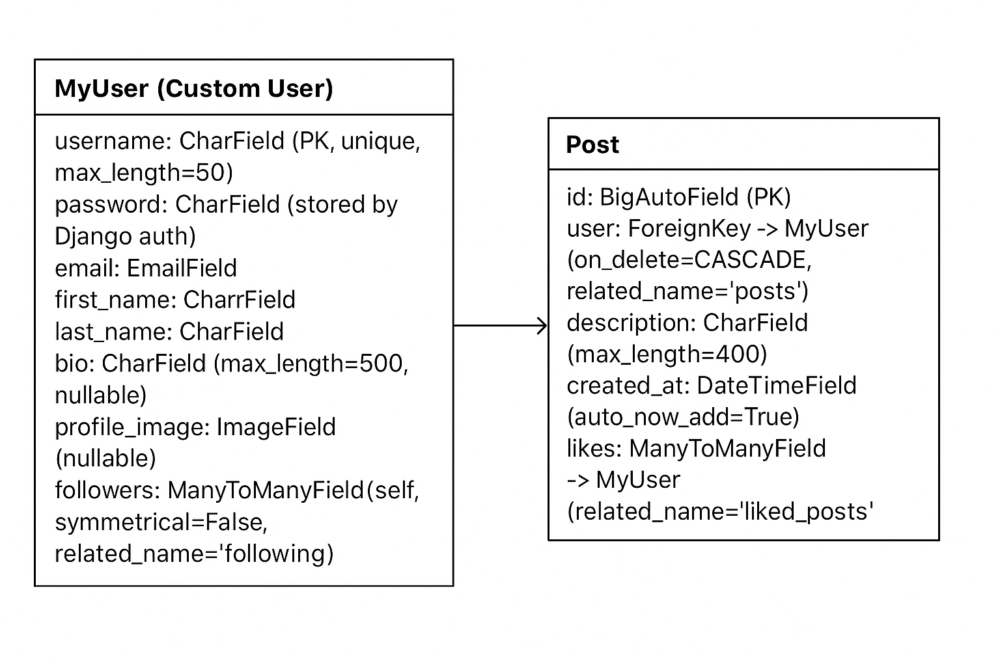

🌐 Nexus — Social Media Feed

Project Nexus 
A full-stack social feed application (React frontend + Django REST backend). Built as a professional portfolio piece to demonstrate advanced frontend skills, API integration, authentication, and a production-ready structure.

📌 Quick facts

Frontend: React (react-scripts) — frontend/

Backend: Django + Django REST Framework — backend/

DB: SQLite (included as backend/db.sqlite3)

✅ Features

Authentication: login & register (JWT tokens).

Home feed: aggregated posts.

Post creation (create_post endpoint).

User profile pages (user_data).

Search users.

Follow / unfollow (toggle_follow).

Like / unlike posts (toggleLike).

Settings page (update profile).

Media uploads (user avatars / post media) — served from MEDIA_URL/MEDIA_ROOT.

Responsive UI components (React + Chakra UI present in package.json).

📁 Exact project structure (cleaned, relevant files only)
social_media_website /
├─ backend/
│  ├─ .dockerignore
│  ├─ db.sqlite3
│  ├─ Dockerfile
│  ├─ fly.toml
│  ├─ manage.py
│  ├─ backend/               # Django project
│  │  ├─ asgi.py
│  │  ├─ settings.py
│  │  ├─ urls.py
│  │  └─ wsgi.py
│  └─ base/                  # Django app
│     ├─ admin.py
│     ├─ authenticate.py
│     ├─ models.py
│     ├─ serializers.py
│     ├─ urls.py
│     ├─ views.py
│     └─ migrations/...
└─ frontend/
   ├─ package.json
   ├─ public/
   │  └─ index.html
   └─ src/
      ├─ App.js
      ├─ index.js
      ├─ api/
      │  └─ endpoints.js
      ├─ components/
      │  ├─ layout.js
      │  ├─ navbar.js
      │  └─ post.js
      ├─ constants/
      │  └─ constants.js   
      ├─ contexts/
      │  └─ useAuth.js
      └─ routes/
         ├─ home.js
         ├─ login.js
         ├─ register.js
         ├─ create_post.js
         ├─ user_profile.js
         ├─ search.js
         └─ settings.js

🛠️ Tech stack 

Frontend

React (react, react-dom)

react-router-dom

axios (API calls)

@chakra-ui/react (UI library)

react-scripts (Create React App)

Backend

Django (project in backend/backend/)

Django REST Framework (rest_framework)

django-cors-headers

rest_framework_simplejwt (JWT authentication)

🔌 How frontend talks to backend

Edit frontend/src/constants/constants.js if your API host changes:

export const SERVER_URL = 'http://127.0.0.1:8000/api'

Axios client is configured in frontend/src/api/endpoints.js to use that base.

📡 API endpoints (from backend/base/urls.py)

These are the available routes you can test (all prefixed with /api/):

GET  /api/get_posts/              -> get posts (feed)
POST /api/create_post/            -> create a post
POST /api/register/               -> register user
POST /api/token/                  -> obtain JWT token
POST /api/token/refresh/          -> refresh JWT
GET  /api/user_data/<pk>/         -> get user profile data
GET  /api/posts/<pk>/             -> get posts by a user
GET  /api/search/?query=...       -> search users
POST /api/toggle_follow/          -> follow/unfollow
POST /api/toggleLike/             -> like/unlike post
PATCH/POST /api/update_user/      -> update profile (multipart/form-data for images)
POST /api/logout/                 -> logout

⚙️ Important notes & tips

The repo contains backend/db.sqlite3. If you want a clean DB during development: remove it then run python manage.py migrate → create test users.

Media files served at MEDIA_URL = '/media/' and stored in MEDIA_ROOT = os.path.join(BASE_DIR, 'media'). Ensure write permissions if deploying to a server.

SECRET_KEY is present in settings.py in this bundle — do not commit a real secret to a public repo. For production, move secrets to environment variables.

There is a Dockerfile and fly.toml in backend/ — you can containerize / deploy to Fly.io if needed.

## ERD DIAGRAM
  

## 📸 Screenshots  

- **Login Page**  
    

- **Register Page**  
    

- **Home Feed**  
    

- **User Profile**  
  

- **Other Users Profiles**  
    

- **Search Page**  
    

- **Post Page**  
    

- **Settings Page**  
    

🏆 Credits

Developed by Aymane Guelbaaoui
